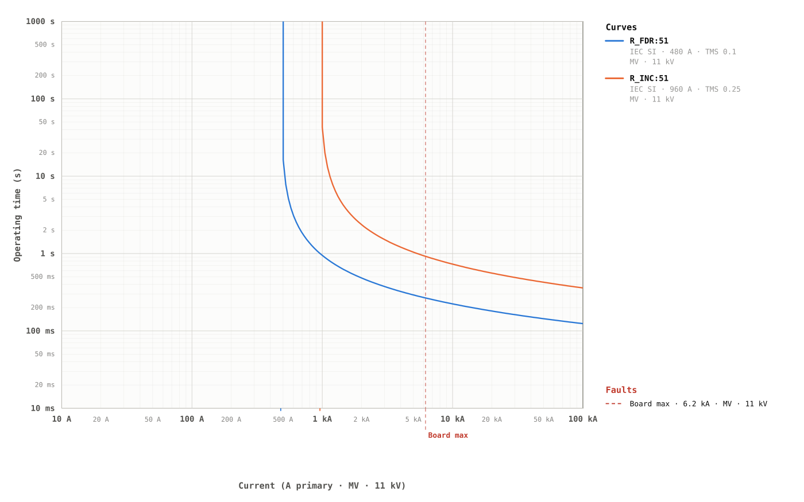
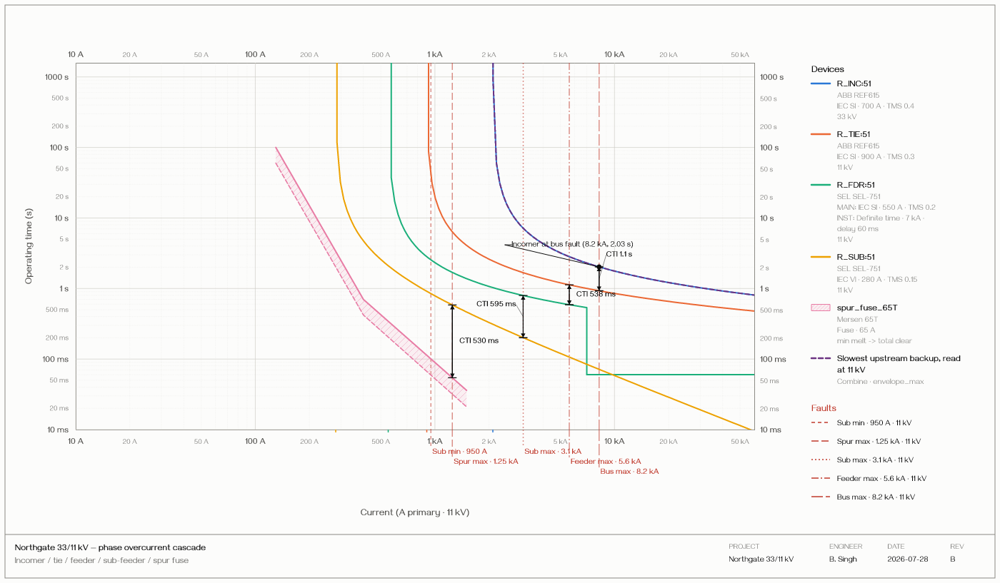
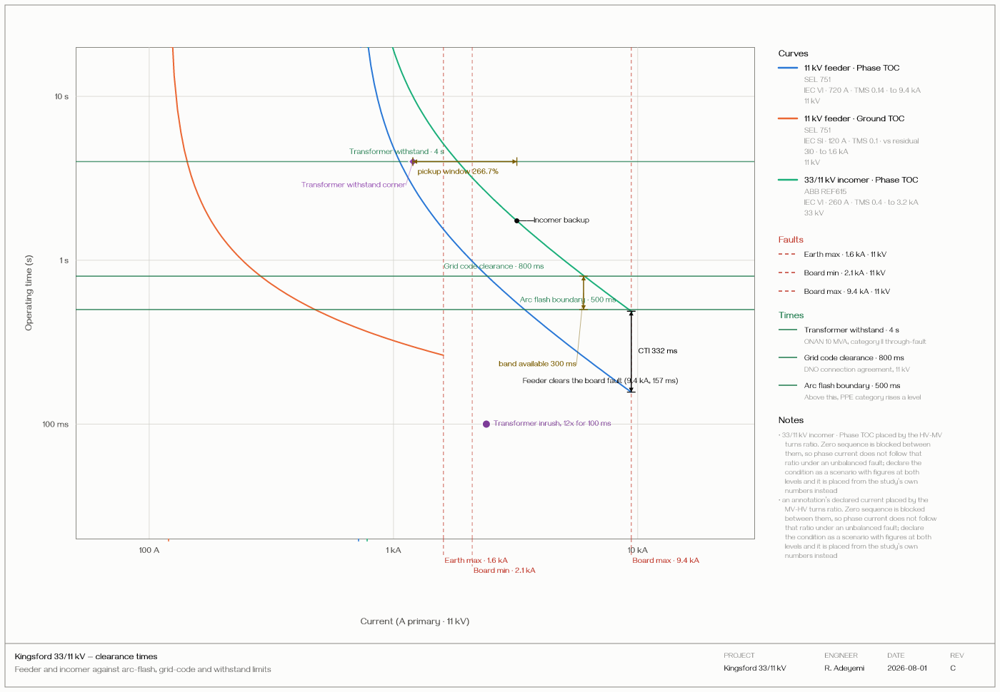
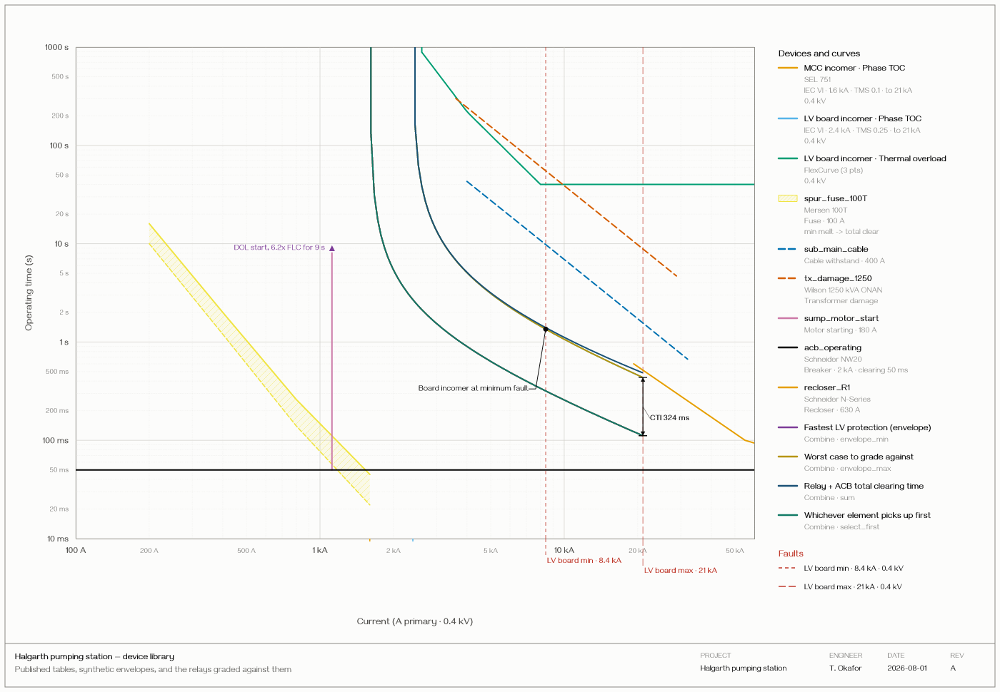
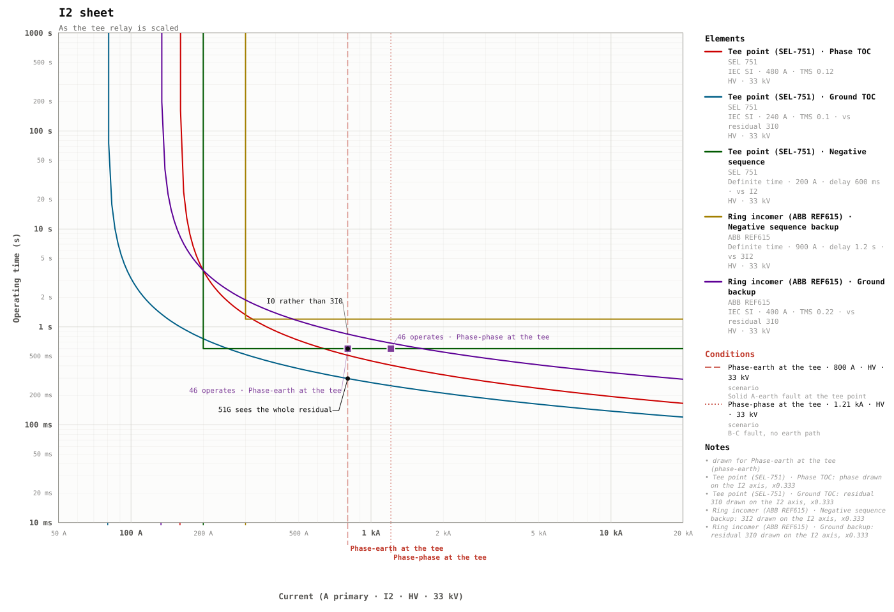

= tc-curves — Time-Current Grading Language
:toc: macro
:toclevels: 2

`tc-curves` is a small text language and renderer for *protection-relay
time-current grading studies*. You describe the relays, the fault levels, and the
grading intent; the tool computes the operate times, checks the margins, and draws
a publication-quality log-log TCC — as SVG, PNG, or PDF.

[TIP]
====
*Try it in the browser: https://openpowershift.github.io/time-current-grading-language/[openpowershift.github.io/time-current-grading-language]*
— a live playground: type `.tc` on the left, see the curves and the margin report
on the right.

Published as `@openpowershift/time-current-grading-language`. See
<<Use as a library>> for programmatic use.
====

[source,tc]
----
grade {
    primary  = R_FDR_1:51;      // 11 kV feeder — trips first
    backup   = R_TRF_INC:51;    // 33 kV incomer — backs it up
    fault    = "F_FDR1_max";
    margin_target = 0.30 s;

    solve { strategy = "tight"; }
}
----

That block is the whole point: the tool works out the backup's time multiplier,
reports the margin actually achieved, and flags it if the target cannot be met.

== Why

A grading study is arithmetic that engineers redo by hand every time a setting
moves — evaluating IEC/IEEE curve formulas at a fault current, subtracting two
operate times, checking the result clears the CTI, then redrawing the chart.
`tc-curves` treats the *study as the source of truth*: the curves, the margins,
and the chart are all derived from one text file, so they are diffable,
reviewable, and regenerated whenever a setting changes.

== Goals & concepts

* *Declarative.* You state pick-ups, curves, and the grading intent. Operate
  times, margins, axis ranges, and the plot are all derived.
* *Standards-backed.* Curve constants are part of the processor, not the source
  file, transcribed from IEC 60255-151:2009 Annex A, IEC 60255-3:1989 (legacy
  LTI/STI), and IEEE C37.112-1996, plus vendor families from SEL, Siemens, GE,
  ABB, and Schneider. A study renders identically wherever it is processed.
* *Voltage levels, not transformers.* Name the levels and let the processor
  derive turns ratios; relays and faults reference a level by name. No
  transformer block to declare and keep in sync.
* *Two kinds of intent, kept distinct.* `CTI_min_s` is a *constraint* — at least
  this margin at every current in the fault's range, reported pass/fail.
  `margin_s` is a *target* at one declared fault current, which a `solve` block
  turns into a computed setting.
* *Everything is checked.* Around forty validation rules cover unknown curve
  ids (with "did you mean"), time-multiplier ranges, mixed element forms,
  unresolved references, combine cycles, implausible pick-ups, and more.

== Use as a library

[source,bash]
----
npm install @openpowershift/time-current-grading-language
----

[source,ts]
----
import {
  process,
  parseAndRender,
  formatGradeReports,
} from "@openpowershift/time-current-grading-language";

const result = process(source);

// Margin reports — one per `grade` block, with any solver-computed settings
console.log(formatGradeReports(result.reports));

// …or go straight to a chart
const { svg } = parseAndRender(source);
----

`process()` runs the whole pipeline — parse, resolve, validate, grade — and
returns the study, the diagnostics, and the reports. SVG rendering is isomorphic
(Node + browser); `exportPng()` and `exportPdf()` produce bytes in either.

Full API and the options tables are in the link:docs/api.adoc[API Reference].

== Command line

[source,bash]
----
npx tc-curves render study.tc              # → study.svg
npx tc-curves render study.tc --png -o out.png
npx tc-curves render study.tc --pdf --size A3 --landscape
npx tc-curves report study.tc              # margin report only
npx tc-curves check  study.tc              # diagnostics only
----

`check` exits `0` when clean and `1` on any error-severity finding, so it works
as a CI gate on a repository of studies.

== Playground / development

Requires Node 20+ (the dev playground uses Node 24 — see `.nvmrc`).

[source,bash]
----
npm install
npm run dev        # live playground at the printed URL
npm run build      # type-check + production build of the playground to dist/
npm run build:lib  # build the publishable library to lib/
npm test           # run the test suite (vitest)
npm run typecheck  # tsc --noEmit
npm run lint       # eslint
----

=== Documentation

Three documents, deliberately separate:

`docs/tutorial.adoc`:: The *tutorial*. A walkthrough that starts with a
single curve and adds one idea at a time -- a second relay, a fault to
grade against, secondary amps, multi-stage elements, earth faults,
fuses, annotations, required times, the drawing itself, several sheets
-- and finishes by introducing scenarios, which is where a study stops
being one number per fault. Every step is a file you can paste into the
playground. Read this first if you have not written a `.tc` file
before.

`docs/guide.adoc`:: The *user guide*. Example-led, about writing
studies, and a single self-contained file -- so it can be read
straight through, or handed whole to a language model asked to produce
a `.tc` study. The playground's *Guide* button opens both,
converted by Asciidoctor at build time (`scripts/guide-plugin.js`),
with a contents list and a filter; a *Tutorial* / *Reference* switch in
the header picks between them, and the tutorial is what opens first.

`spec/spec.adoc`:: The *normative specification*, assembled from
`spec/sections/`. Grammar productions, curve constant tables,
conformance requirements. It answers what the language *is*, which is
the wrong thing to put in front of someone trying to author a file.
Where the two differ, the spec wins.

The code blocks in both are checked against the real parser by
`tests/unit/guide.spec.ts`, so an example cannot teach a mistake. A
further test requires every key and value the editor offers to appear
in the guide, in the spec, and in at least one worked example, so the
four cannot drift apart again.
Conversion runs in the build, not the browser -- Asciidoctor itself is
never shipped, only the HTML it produced, in a chunk fetched on first
open.

== A taste of the language

[source,tc]
----
system {
    voltages {
        "HV" { V  = 33.0 kV; }
        "LV" { V  = 11.0 kV; }
    }
}

faults {
    "F_FDR1_max" { I   = 6.40 kA; voltage = "LV"; }
}

relay R_TRF_INC {
    voltage  = "HV";
    ct_ratio = 600/5;

    element 51 { function = "phase_oc"; curve = iec.si; I_pickup = 720 A; tms = 0.30; }
}

relay R_FDR_1 {
    voltage  = "LV";
    ct_ratio = 400/5;

    element 50 { curve = definite; I_pickup = 3200 A; t_delay = 0.05 s; }
    element 51 { curve = iec.vi;   I_pickup =  480 A; tms = 0.25; }
}

grade {
    primary   = R_FDR_1:51;
    backup    = R_TRF_INC:51;
    fault     = "F_FDR1_max";
    margin    = 0.30 s;
}
----

...which reports:

[source,console]
----
grade R_FDR_1:51 / R_TRF_INC:51:
    fault           = F_FDR1_max (I_f = 6400 A on LV)
    CTI_min         = 0.300 s
    seen by primary = 6400 A    seen by backup = 2133 A
    t_primary       = 0.274 s        (M = 13.33)
    t_backup        = 1.912 s        (M = 2.96)
    achieved margin = 1.639 s        -- pass
----

The link:spec/spec.adoc[language specification] is the normative reference for
the grammar, the curve tables, and the grading semantics. Implementation status
and the resolved spec ambiguities are tracked in
link:IMPLEMENTATION.adoc[IMPLEMENTATION.adoc].

== Gallery

Five sheets, each drawn by the tool from the source beside it. Every one
is a file in `examples/` -- the same files the test suite validates, so
nothing here is a mock-up -- and every one is loaded in the playground
under `Gallery 1`..`Gallery 5`, so you can change a setting and watch
the margin move.

=== The smallest study that says anything

Two relays and one fault. This is the whole language in thirty lines:
declare the levels, declare the relays, say which must clear first and
by how much.

TIP: Open it in the playground: https://openpowershift.github.io/time-current-grading-language/?example=minimal[Gallery 1 — try it]. It is also in the picker, listed as *Gallery 1*.

.Source — `examples/00-minimal.tc`
[%collapsible]
====
[source,tc]
----
# Sample 00 — The smallest study that says anything
#
# Two relays, one fault, one question: does the feeder clear before the
# incomer? Everything else in this library is an elaboration of this.

system {
  voltages {
    "MV" {
      V = 11 kV;
    }
  }
}

faults {
  "Board max" {
    I = 6.2 kA;
    type = three_phase;
    voltage = "MV";
  }
}

relay R_FDR {
  voltage = "MV";
  ct_ratio = 400/5;
  element 51 {
    function = "phase_oc";
    curve = iec.si;
    I_pickup = 480 A;
    tms = 0.10;
  }
}

relay R_INC {
  voltage = "MV";
  ct_ratio = 1200/5;
  element 51 {
    function = "phase_oc";
    curve = iec.si;
    I_pickup = 960 A;
    tms = 0.25;
  }
}

grade {
  primary = R_FDR:51;
  backup = R_INC:51;
  fault = "Board max";
  margin = 0.30 s;
}
----
====

=== A four-level cascade

An incomer, a tie, a feeder, a sub-feeder and a spur fuse, each graded
against the one behind it. The margin arrows are drawn at the fault
they were computed at, and the fuse is a shaded band rather than a line
-- it *may* start to melt at the lower curve and is *guaranteed* clear
by the upper.

TIP: Open it in the playground: https://openpowershift.github.io/time-current-grading-language/?example=cascade[Gallery 2 — try it]. It is also in the picker, listed as *Gallery 2*.

.Source — `examples/10-substation-cascade.tc`
[%collapsible]
====
[source,tc]
----
# Sample 10 — Four-level substation cascade
#
# A realistic grading chain from an 33 kV incomer down to a spur fuse,
# six characteristics on one sheet:
#
#   R_INC:51      33 kV incomer, IEC SI          (slowest, last resort)
#   R_TIE:51      11 kV bus tie, IEC SI
#   R_FDR:51/50   11 kV feeder, IDMT + high-set  (composite)
#   R_SUB:51      11 kV sub-feeder, IEC VI
#   spur_fuse_65T 65T expulsion fuse             (fastest, at the end)
#
# Each adjacent pair is graded, and each margin is annotated at the
# fault that governs it — so the sheet carries the whole coordination
# argument, not just the curves.
#
# In the playground, press ? (or Ctrl-Space) for completions: on a blank
# line it lists what the enclosing block accepts, and after an `=` it
# lists that field's values -- curve names, quantities, declared
# conditions and voltage levels included.

meta {
  project = "Northgate 33/11 kV";
  study = "Phase overcurrent cascade";
  engineer = "B. Singh";
  date = "2026-07-28";
  revision = "B";
  standard  = ["IEC_60255_151"];
  margin = 0.30 s;
}

system {
  voltages {
    "HV" {
      V = 33.0 kV;
      description = "33 kV incomer";
    }
    "MV" {
      V = 11.0 kV;
      description = "11 kV switchboard";
    }
  }
  base_S = 25.0 MVA;
}

faults {
  "Bus max" {
    I = 8.20 kA;
    voltage = "MV";
  }
  "Feeder max" {
    I = 5.60 kA;
    voltage = "MV";
  }
  "Sub max" {
    I = 3.10 kA;
    voltage = "MV";
  }
  "Spur max" {
    I = 1.25 kA;
    voltage = "MV";
  }
  "Sub min" {
    I = 0.95 kA;
    voltage = "MV";
  }
}

device "spur_fuse_65T" {
  kind = "fuse";
  maker = "Mersen";
  model = "65T";
  rating_I = 65 A;
  min_melt    = [(130 A, 60 s), (400 A, 0.42 s), (1500 A, 0.021 s)];
  total_clear = [(130 A, 100 s), (400 A, 0.70 s), (1500 A, 0.036 s)];
}

relay R_INC {
  voltage = "HV";
  maker = "ABB";
  model = "REF615";
  ct_ratio = 600/5;
  element 51 {
    function = "phase_oc";
    curve = iec.si;
    I_pickup = 700 A;
    tms = 0.40;
  }
}

relay R_TIE {
  voltage = "MV";
  maker = "ABB";
  model = "REF615";
  ct_ratio = 800/5;
  element 51 {
    function = "phase_oc";
    curve = iec.si;
    I_pickup = 900 A;
    tms = 0.30;
  }
}

relay R_FDR {
  voltage = "MV";
  maker = "SEL";
  model = "SEL-751";
  ct_ratio = 600/5;
  element 51 {
    function = "phase_oc";
    stages {
      stage main {
        curve = iec.si;
        I_pickup = 550 A;
        tms = 0.20;
      }
      stage inst {
        curve = definite;
        I_pickup = 7000 A;
        t_delay = 0.06 s;
      }
    }
  }
}

relay R_SUB {
  voltage = "MV";
  maker = "SEL";
  model = "SEL-751";
  ct_ratio = 300/5;
  element 51 {
    function = "phase_oc";
    curve = iec.vi;
    I_pickup = 280 A;
    tms = 0.15;
  }
}

# ---- the coordination chain, checked at each level -------------------
grade {
  primary = R_TIE:51;
  backup = R_INC:51;
  fault = "Bus max";
  margin = 0.30 s;
  upstream = true;
}

grade {
  primary = R_FDR:51;
  backup = R_TIE:51;
  fault = "Feeder max";
  margin = 0.30 s;
  upstream = true;
}

# The sweep's default ceiling is the largest fault anywhere in the
# study — here the 8.2 kA bus fault. A sub-feeder can never see that:
# its own maximum is 3.1 kA. Left unbounded the sweep runs into the
# feeder's 7 kA high-set and reports a margin inversion for a current
# this pair cannot experience. `upstream_to` bounds the sweep to what
# is physically reachable.
grade {
  primary = R_SUB:51;
  backup = R_FDR:51;
  fault = "Sub max";
  margin = 0.30 s;
  upstream_to = 3.1 kA;
}

grade {
  primary = spur_fuse_65T;
  backup = R_SUB:51;
  fault = "Spur max";
  margin = 0.15 s; # fuse-relay pairs run tighter
}

# ---- each margin, on the sheet ---------------------------------------
annotate {
  primary = R_TIE:51;
  backup = R_INC:51;
  fault = "Bus max";
  label = "CTI";
}
annotate {
  primary = R_FDR:51;
  backup = R_TIE:51;
  fault = "Feeder max";
  label = "CTI";
}
annotate {
  primary = R_SUB:51;
  backup = R_FDR:51;
  fault = "Sub max";
  label = "CTI";
}
annotate {
  primary = spur_fuse_65T;
  backup = R_SUB:51;
  fault = "Spur max";
  label = "CTI";
}

annotate {
  on_curve = R_INC:51;
  at_I = 8.2 kA;
  label = "Incomer at bus fault";
  style = "leader";
  coords = true;
}

page {
  # A five-device cascade wants the extra width.
  size = "Legal";
  orientation = "landscape";
  theme = "light";
  border = true;
  title = {
    text = "Northgate 33/11 kV — phase overcurrent cascade";
    subtitle = "Incomer / tie / feeder / sub-feeder / spur fuse";
  };
  legend {
    title = "Devices";
  }
  axes {
    mirror = true;
  } # scales repeated top and right
  faults {
    width_px = 1.5;
  } # a touch heavier; each gets its own dash
}

view {
  voltage = "MV";
  current_max = 60 kA;
  time_pad_high = 0.2;
}
----
====

=== Clearance times

A study is judged up and down as well as left to right. An arc-flash
boundary, a grid-code disconnection time and a transformer withstand
are drawn as horizontal rules, so the requirement sits beside the
characteristic that has to meet it. Each curve also stops at the
largest fault its bus can deliver, rather than running to the frame.

TIP: Open it in the playground: https://openpowershift.github.io/time-current-grading-language/?example=clearance[Gallery 3 — try it]. It is also in the picker, listed as *Gallery 3*.

.Source — `examples/13-clearance-times.tc`
[%collapsible]
====
[source,tc]
----
# Sample 13 — Clearance times: grading against the other axis
#
# A coordination study is usually read left to right: at this current,
# does the downstream device clear before the upstream one? But a study
# is also judged UP AND DOWN. An arc-flash boundary, a grid-code
# disconnection time, a transformer through-fault withstand — each is a
# time the protection must beat, at a current someone has already fixed.
#
# `times { ... }` puts those on the sheet as horizontal rules, so the
# requirement sits beside the characteristic that has to meet it instead
# of in the reader's head.
#
# In the playground, press ? (or Ctrl-Space) for completions: on a blank
# line it lists what the enclosing block accepts, and after an `=` it
# lists that field's values — and only the ones legal where you are.

meta {
  project = "Kingsford 33/11 kV";
  study = "Clearance times against the incomer";
  engineer = "R. Adeyemi";
  date = "2026-08-01";
  revision = "C";
  margin = 0.30 s;
}

system {
  voltages {
    "HV" {
      V = 33.0 kV;
      description = "33 kV incoming";
    }
    "MV" {
      V = 11.0 kV;
      description = "11 kV switchboard";
    }
  }
}

faults {
  "Board max" {
    I = 9.4 kA;
    type = three_phase;
    voltage = "MV";
  }
  "Board min" {
    I = 2.1 kA;
    type = two_phase;
    voltage = "MV";
  }
  "Earth max" {
    I = 1.6 kA;
    type = single_phase_earth;
    voltage = "MV";
  }
}

# ---- The requirements, as horizontal rules. --------------------------
#      A time needs no voltage level: a second is a second on every
#      winding, which is the one way this is simpler than a fault.
#
#      `at_I` says where along the rule to write its name. The rule
#      spans the whole plot, so its caption has no natural anchor and
#      goes at the left-hand end unless told otherwise — put it beside
#      the curve the requirement actually bites on.
times {
  "Arc flash boundary" {
    t = 500 ms;
    at_I = 6 kA;
    description = "Above this, PPE category rises a level";
  }
  "Grid code clearance" {
    t = 800 ms;
    at_I = 3 kA;
    description = "DNO connection agreement, 11 kV";
  }
  "Transformer withstand" {
    t = 4 s;
    at_I = 1.2 kA;
    description = "ONAN 10 MVA, category II through-fault";
  }
}

# ---- The board feeder. -----------------------------------------------
relay R_FDR {
  name = "11 kV feeder";
  maker = "SEL";
  model = "751";
  reference = "Panel 3B, relay 2";
  voltage = "MV";
  ct_ratio = 600/5;

  element 51 {
    name = "Phase TOC";
    function = "phase_oc";
    curve = iec.vi;
    I_pickup = 720 A;
    tms = 0.14;

    # The board cannot deliver more than 9.4 kA, so the curve stops
    # there. Drawn to the frame it would invite a margin to be read
    # at a fault this network cannot produce.
    current_max = 9.4 kA;
  }

  element 51G {
    name = "Ground TOC";
    function = "earth_fault";
    curve = iec.si;
    I_pickup = 120 A;
    tms = 0.10;
    current_max = 1.6 kA;
  }
}

# ---- The incomer it grades against. ----------------------------------
relay R_INC {
  name = "33/11 kV incomer";
  maker = "ABB";
  model = "REF615";
  voltage = "HV";
  ct_ratio = 300/5;

  element 51 {
    name = "Phase TOC";
    function = "phase_oc";
    curve = iec.vi;
    I_pickup = 260 A;
    tms = 0.40;
    current_max = 3.2 kA;
  }
}

grade {
  primary = R_FDR:51;
  backup = R_INC:51;
  fault = "Board max";
  margin = 0.30 s;
  comment = "the case the arc-flash boundary is written for";
}

grade {
  primary = R_FDR:51;
  backup = R_INC:51;
  fault = "Board min";
  margin = 0.30 s;
}

# ---- Marking where a requirement is met. -----------------------------
#      `style = tag` is bare text beside the point; `pin` is a dot on
#      the curve with the label alongside; `leader` (the default) draws
#      an elbowed line when the label has to move to find room.
annotate {
  on_curve = R_FDR:51;
  at_I = 9.4 kA;
  label = "Feeder clears the board fault";
  style = tag;
  coords = true;
}

annotate {
  on_curve = R_INC:51;
  at_I = 3.2 kA;
  label = "Incomer backup";
  style = pin;
}

# ---- The margin the study exists to prove. ---------------------------
annotate {
  primary = R_FDR:51;
  backup = R_INC:51;
  fault = "Board max";
  label = "CTI";
}

# ---- A marked point taken from the fault study. ----------------------
point "Withstand corner" {
  I = 1.2 kA;
  t = 4 s;
  label = "Transformer withstand corner";
  shape = diamond;
  color = "#8e44ad";
}

point "Inrush" {
  I = 2.4 kA;
  t = 100 ms;
  label = "Transformer inrush, 12x for 100 ms";
  shape = circle;
}

page {
  size = "A3";
  orientation = "landscape";
  theme = "light";
  border = true;

  # Rules are styled independently, so it is never a question which
  # axis a given rule belongs to.
  faults = {
    style = "dashed";
    labels = true;
  };
  times  = {
    style = "solid";
    color = "#1d7a4c";
    width_px = 1.6;
    labels = true;
  };

  scale  = {
    tick_density = "sparse";
  };

  title  = {
    text = "Kingsford 33/11 kV — clearance times";
    subtitle = "Feeder and incomer against arc-flash, grid-code and withstand limits";
  };
}

view {
  voltage = "MV";
  quantity = any;
  current_min = 50 A;
  current_max = 30 kA;
  time_min = 20 ms;
  time_max = 20 s;
}
----
====

=== Devices from published tables

Not everything on a sheet is a relay setting. A fuse, a cable, a
transformer's damage limit, a motor start and a breaker's own clearing
time are all published as tables of (current, time) pairs. `combine`
then builds synthetic curves from what is already declared -- the
fastest of a group, the slowest, their sum.

TIP: Open it in the playground: https://openpowershift.github.io/time-current-grading-language/?example=devices[Gallery 4 — try it]. It is also in the picker, listed as *Gallery 4*.

.Source — `examples/14-devices-and-combine.tc`
[%collapsible]
====
[source,tc]
----
# Sample 14 — Devices from published tables, and synthetic curves
#
# Not everything on a coordination sheet is a relay setting. A fuse, a
# cable, a transformer's damage limit, a motor start, a breaker's own
# operating time — each is a curve someone else published, given as a
# TABLE of (current, time) pairs rather than as constants in a formula.
#
#   flex_points = [(240 A, 50.0 s), (600 A, 5.0 s), ...]
#
# `device` carries those. `kind` says what sort of thing it is, which
# decides how it is drawn and which way round it should be graded: a
# relay must be FASTER than a cable's damage curve and SLOWER than a
# downstream fuse's total-clear.
#
# `combine` then builds a synthetic curve from curves already declared —
# the envelope of a group, their sum, or the first that operates.
#
# Press ? in the playground for completions; after `kind =` it lists
# exactly the six kinds, and after `as =` the four combining rules.

meta {
  project = "Halgarth pumping station";
  study = "Device library and protected envelope";
  engineer = "T. Okafor";
  date = "2026-08-01";
  revision = "A";
  margin = 0.30 s;
}

system {
  voltages {
    "MV" {
      V = 11.0 kV;
      description = "11 kV incoming";
    }
    "LV" {
      V = 0.4 kV;
      description = "400 V motor board";
    }
  }
  I_base = 1000 A;
}

faults {
  "LV board max" {
    I = 21 kA;
    type = three_phase;
    voltage = "LV";
  }
  "LV board min" {
    I = 8.4 kA;
    type = two_phase;
    voltage = "LV";
  }
}

# ---- The published curves. -------------------------------------------
#      Each is a table read off a manufacturer's sheet. `reference`
#      records where, because a number nobody can trace is a number
#      nobody can check.

device "spur_fuse_100T" {
  kind = fuse;
  voltage = "LV";
  maker = "Mersen";
  model = "100T";
  rating_I = 100 A;
  rating_V = 0.6 kV;
  reference = "Mersen T-link data sheet, table 2";
  description = "Spur fuse to the sump pump";

  # A fuse is a band, not a line: it may start to melt at the first
  # curve and is guaranteed clear by the second. The renderer shades
  # between them, so no `combine` is needed.
  min_melt    = [(200 A, 10.0 s), (400 A, 1.20 s), (800 A, 0.14 s), (1.6 kA, 0.022 s)];
  total_clear = [(200 A, 16.0 s), (400 A, 2.00 s), (800 A, 0.26 s), (1.6 kA, 0.045 s)];
}

device "sub_main_cable" {
  kind = cable;
  voltage = "LV";
  rating_I = 400 A;
  reference = "IEC 60949, 185 mm2 Cu XLPE, k = 143";
  description = "Board to motor control centre, 185 mm2";

  # Adiabatic damage: t = (k*S/I)^2. Tabulated here rather than
  # derived, so the sheet shows the same numbers the cable schedule does.
  flex_points = [(4 kA, 43.0 s), (8 kA, 10.8 s), (16 kA, 2.70 s), (32 kA, 0.67 s)];
}

device "tx_damage_1250" {
  kind = transformer_damage;
  voltage = "LV";
  maker = "Wilson";
  model = "1250 kVA ONAN";
  rating_S = 1.25 MVA;
  rating_V = 11 kV;
  reference = "IEEE C57.109 category II";
  description = "Through-fault withstand, delta-star";

  flex_points = [(3.6 kA, 300 s), (7.2 kA, 75 s), (14.4 kA, 18.8 s), (28.8 kA, 4.7 s)];
}

device "sump_motor_start" {
  kind = motor_startup;
  voltage = "LV";
  rating_I = 180 A;
  reference = "Motor data sheet, DOL, 6.2x FLC";
  description = "132 kW sump pump, direct on line";

  # The start is a load, not a fault: nothing may trip during it.
  flex_points = [(1.12 kA, 9.0 s), (1.12 kA, 0.05 s)];
}

device "acb_operating" {
  kind = breaker;
  voltage = "LV";
  maker = "Schneider";
  model = "NW20";
  rating_I = 2000 A;
  reference = "Masterpact NW catalogue, opening + arcing";
  description = "Air circuit breaker own clearing time";
  t_delay = 50 ms;
}

device "recloser_R1" {
  kind = recloser;
  voltage = "MV";
  maker = "Schneider";
  model = "N-Series";
  rating_I = 630 A;
  reference = "N-Series fast curve, 11 kV pole-top";
  description = "Pole-top recloser, fast operation";

  flex_points = [(700 A, 0.60 s), (2 kA, 0.10 s), (6 kA, 0.045 s)];
}

# ---- The relays being graded against them. ---------------------------
relay R_MCC {
  name = "MCC incomer";
  maker = "SEL";
  model = "751";
  reference = "MCC-1 panel";
  voltage = "LV";
  ct_ratio = 2000/5;

  element 51 {
    name = "Phase TOC";
    function = "phase_oc";
    curve = iec.vi;
    I_pickup = 1.6 kA;
    tms = 0.10;
    current_max = 21 kA;
  }
}

relay R_BOARD {
  name = "LV board incomer";
  voltage = "LV";
  ct_ratio = 3000/5;

  element 51 {
    name = "Phase TOC";
    function = "phase_oc";
    curve = iec.vi;
    I_pickup = 2.4 kA;
    tms = 0.25;
    current_max = 21 kA;
  }

  # An element can carry a table too, when the device it models is
  # not one of the built-in kinds.
  element 49 {
    name = "Thermal overload";
    function = "thermal";
    flex_points = [(2.6 kA, 900 s), (4 kA, 220 s), (8 kA, 40 s)];
  }
}

# ---- Synthetic curves. -----------------------------------------------
#      `combine` draws a curve that is not any one device's:
#
#        envelope_min   the fastest of the group at every current
#                       — what actually clears, whichever acts first
#        envelope_max   the slowest — the worst case to grade against
#        sum            times added, for series operations
#        select_first   the first source that operates at all
#
#      They are curves like any other, so they can be graded and
#      annotated.

combine {
  name = "Fastest LV protection";
  sources = [R_MCC:51, R_BOARD:51];
  as = envelope_min;
  label = "Fastest LV protection (envelope)";
  color = "#7d3c98";
}

combine {
  name = "Slowest LV protection";
  sources = [R_MCC:51, R_BOARD:51];
  as = envelope_max;
  label = "Worst case to grade against";
  color = "#b7950b";
}

combine {
  name = "Board clear incl. breaker";
  sources = [R_BOARD:51, acb_operating];
  as = sum;
  label = "Relay + ACB total clearing time";
  color = "#1a5276";
}

combine {
  name = "First to operate";
  sources = [R_MCC:51, R_BOARD:49];
  as = select_first;
  label = "Whichever element picks up first";
  color = "#117a65";
}

# ---- Grading. --------------------------------------------------------
grade {
  primary = R_MCC:51;
  backup = R_BOARD:51;
  fault = "LV board max";
  margin = 0.30 s;
  comment = "MCC ahead of the board incomer";
}

annotate {
  primary = R_MCC:51;
  backup = R_BOARD:51;
  fault = "LV board max";
  label = "CTI";
}

annotate {
  on_curve = R_BOARD:51;
  at_I = 8.4 kA;
  label = "Board incomer at minimum fault";
  style = leader;
}

point "Motor start corner" {
  I = 1.12 kA;
  t = 9 s;
  label = "DOL start, 6.2x FLC for 9 s";
  shape = triangle;
}

page {
  size = "A3";
  orientation = "landscape";
  theme = "light";
  border = true;
  legend      = {
    title = "Devices and curves";
    position = "right";
    swatch = "line";
  };
  curves      = {
    palette = "okabe_ito";
    line_width_px = 1.8;
  };
  points      = {
    shape = "triangle";
    size_px = 8;
    outline = true;
  };
  title       = {
    text = "Halgarth pumping station — device library";
    subtitle = "Published tables, synthetic envelopes, and the relays graded against them";
  };
}

view {
  voltage = "LV";
  quantity = any;
  current_min = 100 A;
  current_max = 60 kA;
  time_min = 10 ms;
  time_max = 1 ks;
}
----
====

=== Sequence currents

A relay does not measure "the fault current". At one unbalanced fault a
`51` sees phase current, a `51G` sees the residual `3*I0` and a `46`
sees negative sequence -- three different numbers. Name the condition a
sheet depicts and every curve is placed on the chosen axis using that
condition's own declared figures, with the conversion factor stated.

TIP: Open it in the playground: https://openpowershift.github.io/time-current-grading-language/?example=sheets[Gallery 5 — try it]. It is also in the picker, listed as *Gallery 5*.

.Source — `examples/17-sequence-sheets.tc`
[%collapsible]
====
[source,tc]
----
# Sample 17 — One study, four sheets: phase, I2, 3I2 and 3I0
#
# A relay does not measure "the fault current". At one unbalanced fault
# there are several different currents, and each element is evaluated
# against the one it actually sees. Which of them the sheet's x-axis is
# drawn in is a choice — and a sheet that does not say is a sheet two
# engineers will read two different ways.
#
#   quantity = phase   ordinary phase current
#   quantity = I2      negative sequence, as a 46 element is often set
#   quantity = 3I2     three times it, as other IEDs are scaled
#   quantity = 3I0     residual, what a 51G measures
#   quantity = any     everything on one axis, whatever it measures
#
# The factor of three between `I2` and `3I2` decides whether an element
# operates at all, so `measures` has no default and must be stated.
#
# `annotate` can name the component it is placed at — `at_I` for phase,
# `at_I1`, `at_I2`, `at_I0`, `at_residual` — instead of leaving the
# reader to work out which current a bare number meant.

meta {
  project = "Cardross 33 kV";
  study = "Sequence sheets for an unbalanced fault";
  engineer = "P. Nowak";
  date = "2026-08-01";
  revision = "A";
  margin = 0.30 s;
}

system {
  voltages {
    "HV" {
      V = 33.0 kV;
      description = "33 kV ring";
    }
  }
}

# ---- Two conditions, both unbalanced. --------------------------------
scenario "Phase-earth at the tee" {
  type = single_phase_earth;
  description = "Solid A-earth fault at the tee point";

  # I1 = I2 = I0 = If/3 for a solid phase-earth fault; the residual
  # 3*I0 is the whole fault current.
  level "HV" {
    I = 2.4 kA;
    I1 = 800 A;
    I2 = 800 A;
    I0 = 800 A;
    residual = 2.4 kA;
  }
}

scenario "Phase-phase at the tee" {
  type = two_phase;
  description = "B-C fault, no earth path";

  # A phase-phase fault carries no zero sequence at all, so the
  # residual sheet has nothing to draw for it — and says so.
  level "HV" {
    I = 2.1 kA;
    I1 = 1.21 kA;
    I2 = 1.21 kA;
    I0 = 0 A;
    residual = 0 A;
  }
}

faults {
  "Ring max" {
    I = 3.6 kA;
    type = three_phase;
    voltage = "HV";
  }
}

# ---- The tee relay: three elements, three different currents. --------
relay R_TEE {
  name = "Tee point (SEL-751)";
  maker = "SEL";
  model = "751";
  reference = "Cardross tee kiosk";
  voltage = "HV";
  ct_ratio = 400/5;

  element 51 {
    name = "Phase TOC";
    function = "phase_oc"; # -> phase current
    curve = iec.si;
    I_pickup = 480 A;
    tms = 0.12;
  }

  element 51G {
    name = "Ground TOC";
    function = "earth_fault"; # -> residual 3*I0
    curve = iec.si;
    I_pickup = 240 A;
    tms = 0.10;
  }

  element 46 {
    name = "Negative sequence";
    function = "neg_seq";
    measures = I2; # this IED is scaled in I2
    curve = definite;
    I_pickup = 200 A;
    t_delay = 0.60 s;
  }
}

# ---- The ring relay backing it up, scaled in 3*I2. -------------------
#      Same physics, different convention: state which and the tool
#      places both on whichever sheet is asked for.
relay R_RING {
  name = "Ring incomer (ABB REF615)";
  maker = "ABB";
  model = "REF615";
  voltage = "HV";
  ct_ratio = 600/5;

  element 46 {
    name = "Negative sequence backup";
    function = "neg_seq";
    measures = 3I2; # scaled in three times I2
    curve = definite;
    I_pickup = 900 A;
    t_delay = 1.20 s;
  }

  element 51G {
    name = "Ground backup";
    function = "earth_fault";
    measures = 3I0; # residual, stated rather than assumed
    curve = iec.si;
    I_pickup = 400 A;
    tms = 0.22;
  }
}

grade {
  primary = R_TEE:46;
  backup = R_RING:46;
  scenario = "Phase-earth at the tee";
  margin = 0.30 s;
  comment = "both measure negative sequence, one scaled by three";

  solve {
    strategy = safety_factor;
    tolerance_pct = 10;
    comment = "what a 1.5x safety factor on the target would need";
  }
}

grade {
  primary = R_TEE:51G;
  backup = R_RING:51G;
  scenario = "Phase-earth at the tee";
  margin = 0.30 s;
}

# ---- Annotations that name their component. --------------------------
#      A bare `at_I` is a phase current. On a sequence sheet that is
#      rarely what is meant, so each component has its own spelling.
annotate {
  on_curve = R_TEE:46;
  at_I2 = 800 A;
  label = "46 at the phase-earth fault";
  style = pin;
}

annotate {
  on_curve = R_TEE:51G;
  at_residual = 2.4 kA;
  label = "51G sees the whole residual";
  style = leader;
}

annotate {
  on_curve = R_RING:46;
  at_I1 = 800 A;
  label = "positive-sequence reference";
  style = tag;
}

annotate {
  on_curve = R_RING:51G;
  at_I0 = 800 A;
  label = "I0 rather than 3I0";
  style = tag;
}

# `at_t` places the mark by time instead of current — where a curve is
# read the other way round, "what current gives me 300 ms?".
annotate {
  on_curve = R_TEE:51;
  at_t = 300 ms;
  label = "phase element at 300 ms";
  style = pin;
}

# ---- A point drawn for both conditions at once. ----------------------
#      `scenarios` takes a list; the marker is drawn once per condition
#      named, at each one's own figure for the level being shown.
# ---- A mark that belongs to one sheet only. --------------------------
#      `view` (or `views`, for a list) keeps a mark to the sheets it
#      means something on. A phase-current inrush figure is meaningless
#      on the I2 axis; drawn there it invites a reader to compare it
#      against a curve it has nothing to do with.
point "Phase inrush" {
  I = 1.8 kA;
  t = 100 ms;
  view = "Phase";
  label = "Inrush, phase amps";
  shape = cross;
}

times {
  "Earth-fault clearance" {
    t = 800 ms;
    at_I = 400 A;
    views = ["Residual", "Negative sequence"];
  }
}

point "Tee I2" {
  scenarios = ["Phase-earth at the tee", "Phase-phase at the tee"];
  voltage = "HV";
  t = 0.60 s;
  label = "46 operates";
  shape = square;
}

page {
  size = "A4";
  orientation = "landscape";
  theme = "light";
  legend      = {
    title = "Elements";
    position = "top_right";
  };
  curves      = {
    palette = "ieee";
  };
}

# ---- Four sheets of the same study. ----------------------------------
#      `condition` lets curves measuring one quantity be drawn on an
#      axis in another, using that condition's own declared figures.
view "Phase" {
  default = true;
  voltage = "HV";
  quantity = phase;
  condition = "Phase-earth at the tee";
  title = "Phase sheet";
  subtitle = "Everything converted onto phase current";
  current_min = 50 A;
  current_max = 20 kA;

  # Room beyond the fitted range, as a factor, rather than fixed
  # bounds — so the sheet still frames itself if a setting changes.
  time_pad = 1.5;
  time_pad_low = 2;
}

view "Negative sequence" {
  voltage = "HV";
  quantity = I2;
  condition = "Phase-earth at the tee";
  title = "I2 sheet";
  subtitle = "As the tee relay is scaled";
  current_min = 50 A;
  current_max = 20 kA;

  current_pad_low = 1.5;
  current_pad_high = 1.2;
}

view "Three times I2" {
  voltage = "HV";
  quantity = 3I2;
  condition = "Phase-phase at the tee";
  title = "3I2 sheet";
  subtitle = "As the ring relay is scaled — the same physics, x3";
  current_min = 50 A;
  current_max = 20 kA;
}

view "Residual" {
  voltage = "HV";
  quantity = 3I0;
  condition = "Phase-earth at the tee";
  title = "Residual sheet";
  subtitle = "3I0 — what an earth-fault element measures";
  current_min = 50 A;
  current_max = 20 kA;
}
----
====

== Project layout

[cols="1,3",options="header"]
|===
| Path | What

| `src/index.ts`
| Public library API (`process`, `parseAndRender`, `renderStudy`, re-exports)

| `src/cli.ts`
| Node CLI entry (`tc-curves`)

| `src/parser/`
| Tokeniser, recursive-descent parser, and AST for `.tc` source

| `src/constants/`
| Curve constants tables and the device catalog

| `src/semantics/`
| Study model, curve evaluators, stages, combines, cross-voltage, solver,
  grading reports, validation

| `src/renderer/`
| Hand-rolled log-log SVG composer, scales, ticks, palettes, themes

| `src/export/`
| Self-contained SVG, PNG, and PDF export

| `src/editor/`, `src/highlight/`, `src/help/`
| CodeMirror autocompletion, hover help, snippets, and syntax highlighting

| `src/components/`
| Lit web components — the playground app, editor, and viewer

| `spec/`
| AsciiDoc language specification (`spec/spec.adoc`)

| `examples/`
| Sample `.tc` studies, used by the playground and the tests

| `tests/`
| Vitest unit tests, including the spec's normative worked examples
|===

== Status

Under active development, tracking spec v0.1.0-draft. The language, the semantics
(curves, stages, combines, cross-voltage grading, the solver), validation,
rendering, export, the CLI, and the playground are implemented and tested against
the spec's normative worked examples.

Deferred to v0.2 by the spec: distance zones (21), transformer differential (87),
voltage-restrained overcurrent (51V), auto-reclosing (79), per-element `G_D`
override, `safety_factor` solving, multi-variable solving on multi-stage
elements, and interactive curve dragging.

== License

link:LICENSE[MIT] © 2026 Daniel Mulholland
